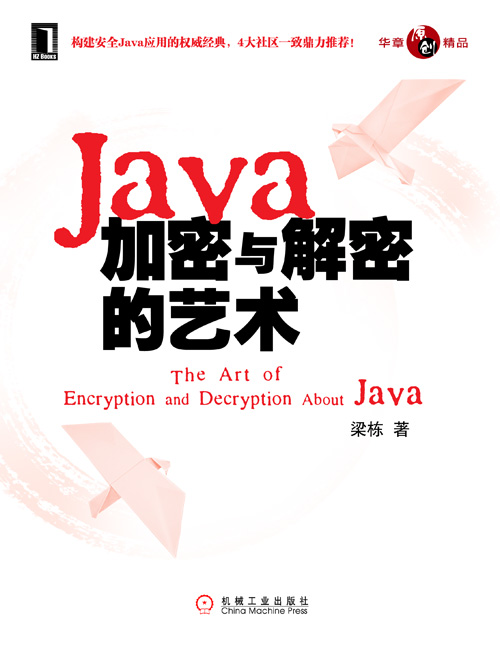
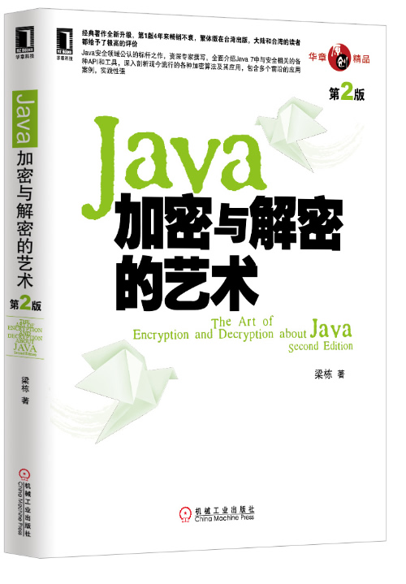

# 《Java加密与解密的艺术》源代码

主要介绍基于Java语言的加密与解密相关源码，包括Java原生、[Bouncy Castle](https://www.bouncycastle.org/ "BouncyCastle")和[Commons Codec](https://commons.apache.org/proper/commons-codec/ "Commons Codec")的代码实现及测试用例。

## 目录

- [文本编码协议(TXP)](#文本编码协议(TXP))
- [数字摘要算法(HF)](#数字摘要算法(HF))
- [对称加密算法(SE)](#对称加密算法(SE))
- [非对称加密算法(AE)](#非对称加密算法(AE))
- [数字签名算法(DS)](#数字签名算法(DS))
- [数字证书签发及认证(CA)](#数字证书签发及认证(CA))

### 文本编码协议(TXP)

"TXP"（"Text Protocol"），即文本协议，相关代码位于TXP目录内。  
这里主要是指Base64编码，共有2种实现方式，分别由Bouncy Castle和Commons Codec提供。     
Base64并不是真正的密码学算法，但它对于我们理解算法实现，以及密文的文本化展示有重要的作用，所以这里也一并将它纳入本书介绍范围中。    

### 数字摘要算法(HF)

"HF"("Hash Function")，即哈希算法函数，包括MD、MAC、SHA，以及RIPE等算法，相关代码位于HF目录内。    
在Java原生算法的基础上，Bouncy Castle和Commons Codec在算法种类上都有更丰富的补充。如Java原生只提供了MD5算法实现，而Bouncy Castle补充了MD4等其他数字摘要算法实现。    

### 对称加密算法(SE)

"SE"（"Symmetric Encryption"），即对称加密算法，包括DES、AES等常见的密文传递算法，相关代码位于SE目录内。    
对称加密算法的密钥长度和算法对于密文安全性有举足轻重的作用，Bouncy Castle提供了较Java原生更长的秘钥（256位），还提供了IDEA等算法实现。    

### 非对称加密算法(AE)

"AE"（"Asymmetric Encryption"），即非对称加密算法，包括大名鼎鼎的RSA算法，以及最初密钥交换算法的原型——DH，相关代码位于AE目录内。   
非对称加密算法主要用于传递对称加密算法的秘钥，因此不适用于加密明文。这里除了DH和RSA算法外，还有Bouncy Castle提供的EIGamal算法实现。

### 数字签名算法(DS)

"DS"("Digital Signature")，即数字签名算法，包括DSA、ECDSA和RSA算法实现，相关代码位于DS目录内。    
Bouncy Castle扩展ECDSA算法实现，提供了丰富的多达7种的ECC签名算法实现。

### 数字证书签发及认证(CA)

"CA"("Certificate Authority")，包括了秘钥管理、证书校验，以及HTTPS协议实现等，相关代码位于CA目录内。

